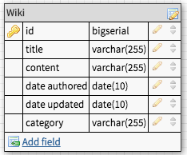
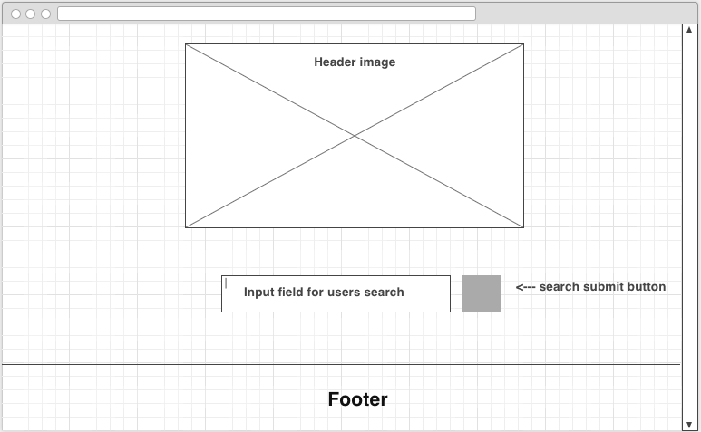
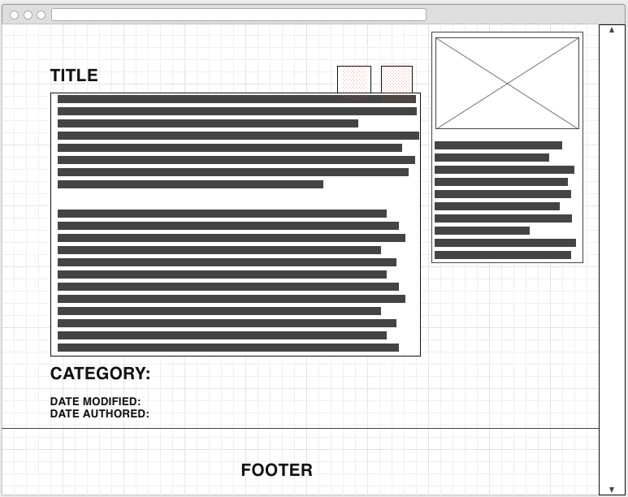

# Project 2 - Wikipedia Clone
---

For my project 2 I decided to try and build a wikipedia clone that uses node.js with express and encorporates markdown for the content of the articles as well as a timestamp from when the article was created, for this I chose to use markdown and timestamp npm packages as well as many others. 

---

---

### Challenges

I definitely came across more than one or two challenges and ultimately was unable to get all the functionality I wanted, but definitely plan on working on this in the near future.
